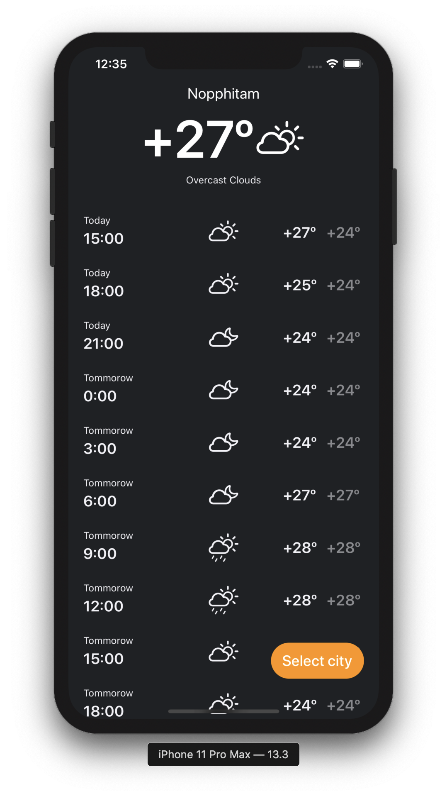

# corewar
# Weather iOS app

This is a simple weather app that consists of two screens.  
Architecture - MVC  
Working with memory - CoreData  
Multithreading With Grand Central Dispatch  
Without third-party frameworks

### Network
Data is taken from the service [open weather map](https://openweathermap.org). Work with the service is done through a separate class `Weather Services`, implemented using the singleton template.

### List of cities
When searching for a city, data is taken from the device. This allows you to upload data faster than over the network, which improves the UX. Data is updated on the main screen using the delegate tool
